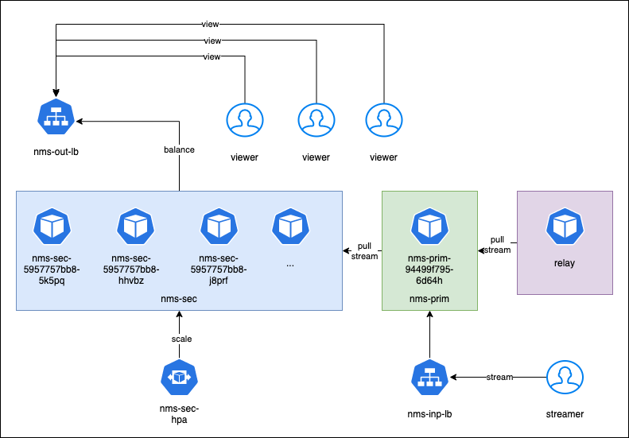

# RTMP streaming helm chart

Helm chart implementation of streaming server based on [Node Media Server](https://github.com/illuspas/Node-Media-Server)

## Docker image

the [docker image](https://hub.docker.com/repository/docker/rexmalebka/streaming-server) I'm using has some implementations for primary-secondary sync along with somoe nms configuration, please check it and chnange it in case of specific usage

to build it run:

```bash
docker build -f ./image/Dockerfile . --tag rexmalebka/streaming-server
```

## Helm implementation

```helm install -f cluster/values.yaml streaming-server cluster```

this implements two load balancers we stream to input load balancer `streaming-server-inp-lb` and receives from `streaming-server-out-lb`.



```bash
➜ helm install -f cluster/values.yaml streaming-server cluster
^[NAME: streaming-server
LAST DEPLOYED: Fri Dec 25 21:50:07 2020
NAMESPACE: default
STATUS: deployed
REVISION: 1
TEST SUITE: None
```

```bash
➜ helm list
NAME            	NAMESPACE	REVISION	UPDATED                             	STATUS  	CHART                  	APP VERSION
streaming-server	default  	1       	2020-12-25 21:50:07.281378 -0600 CST	deployed	streaming-cluster-0.1.0	1.16.0
```

```bash
➜ kubectl get deployment
NAME                    READY   UP-TO-DATE   AVAILABLE   AGE
streaming-server-prim   1/1     1            1           5m
streaming-server-sec    3/3     3            3           5m
```

```bash
➜ kubectl get pods
NAME                                     READY   STATUS    RESTARTS   AGE
configmap-poc                            1/1     Running   11         42d
streaming-server-prim-55fb5d5bd5-kj62z   1/1     Running   0          5m51s
streaming-server-sec-5b9f4c499f-7cjxs    1/1     Running   1          5m51s
streaming-server-sec-5b9f4c499f-g8rtb    1/1     Running   1          5m51s
streaming-server-sec-5b9f4c499f-ghzmj    1/1     Running   1          5m51s
```

```bash
➜ kubectl get service
NAME                      TYPE           CLUSTER-IP       EXTERNAL-IP   PORT(S)                       AGE
kubernetes                ClusterIP      10.96.0.1        <none>        443/TCP                       56d
streaming-server-inp-lb   LoadBalancer   10.107.195.205   <pending>     1935:30267/TCP,80:31145/TCP   6m8s
streaming-server-out-lb   LoadBalancer   10.96.255.40     <pending>     1935:32384/TCP                6m8s
```


```bash
➜ minikube service streaming-server-inp-lb
|-----------|-------------------------|-------------|---------------------------|
| NAMESPACE |          NAME           | TARGET PORT |            URL            |
|-----------|-------------------------|-------------|---------------------------|
| default   | streaming-server-inp-lb | rtmp/1935   | http://192.168.64.2:30267 |
|           |                         | http/80     | http://192.168.64.2:31145 |
|-----------|-------------------------|-------------|---------------------------|
🎉  Opening service default/streaming-server-inp-lb in default browser...
🎉  Opening service default/streaming-server-inp-lb in default browser...
```

```bash
➜ minikube service streaming-server-out-lb
|-----------|-------------------------|-------------|---------------------------|
| NAMESPACE |          NAME           | TARGET PORT |            URL            |
|-----------|-------------------------|-------------|---------------------------|
| default   | streaming-server-out-lb | http/1935   | http://192.168.64.2:32384 |
|-----------|-------------------------|-------------|---------------------------|
🎉  Opening service default/streaming-server-out-lb in default browser...
```

## publishing streaming 

**From OBS**

- __url__: rtmp://<< streaming-server-inp-lb url >>/live
- __stream key__: STREAM_NAME

## acccesing livestream

**rtmp**

rtmp://<< streaming-server-out-lb url >>/live/STREAM_NAME

**more options**

For more options of accesing streaming, check [Node Media Server documentation](https://github.com/illuspas/Node-Media-Server#accessing-the-live-stream)

## The future

- [ ] add configuration json options for  nms in ` values.yml` 
- [ ] test [Horizontal Pod Scaler](https://kubernetes.io/docs/tasks/run-application/horizontal-pod-autoscale/#:~:text=The%20Horizontal%20Pod%20Autoscaler%20automatically,other%20application%2Dprovided%20metrics) for improving secondary implementations
- [ ] secure rtmp pushing
- [ ] check tls certs
- [ ] improve testing
- [ ] save recording option
- [ ] push to other rtmp 

please feel free to add any issues / new features here.

